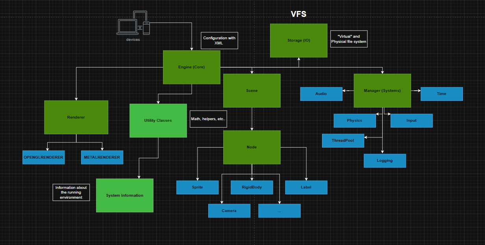
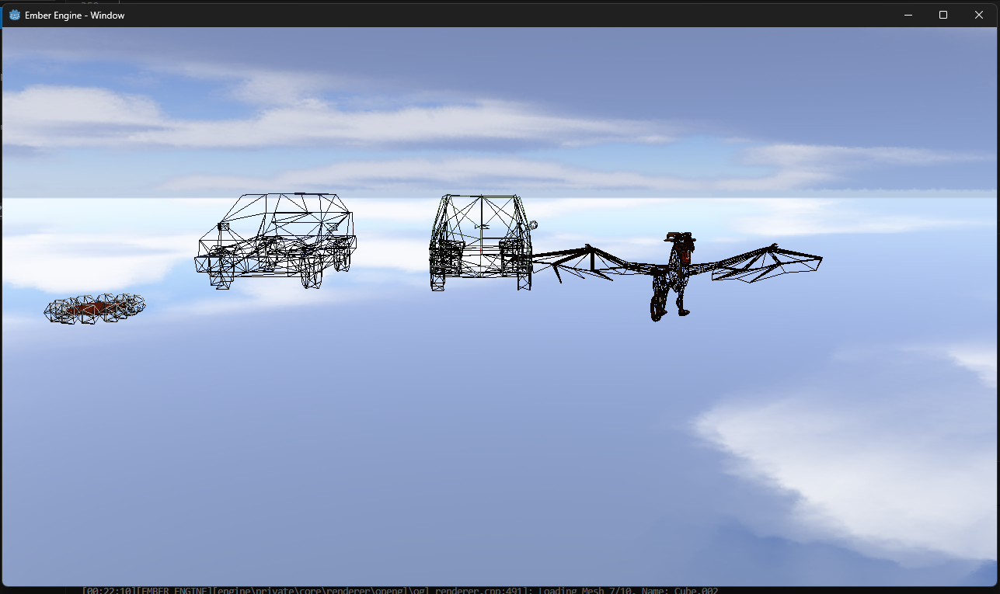
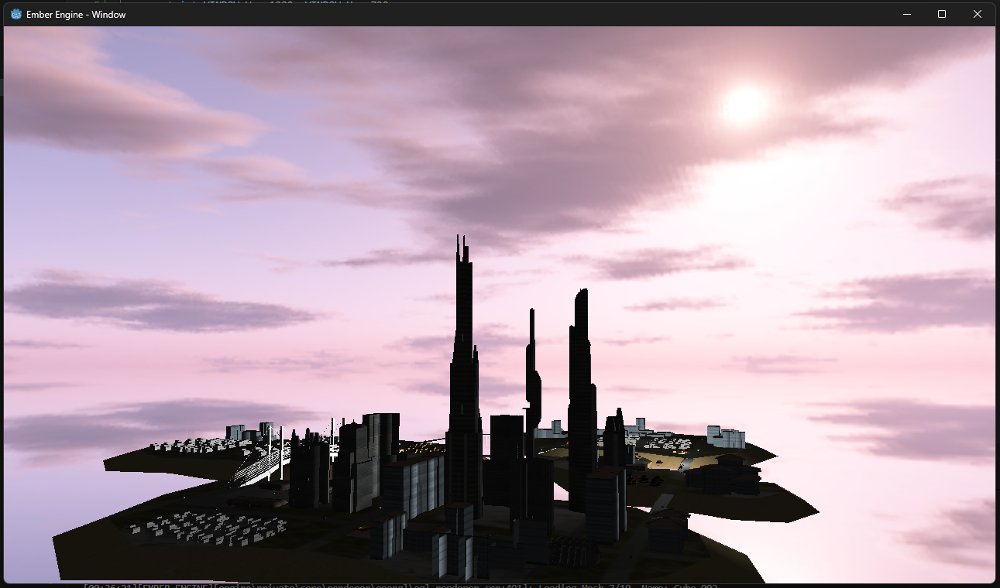
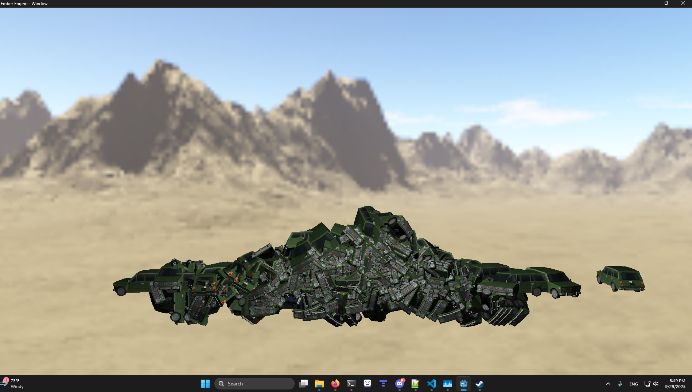
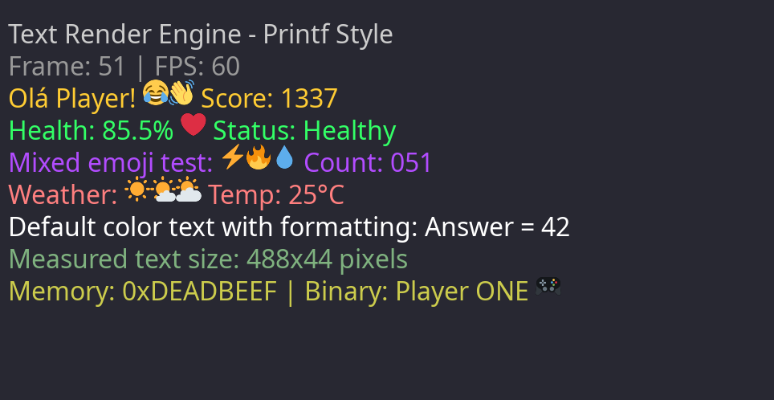
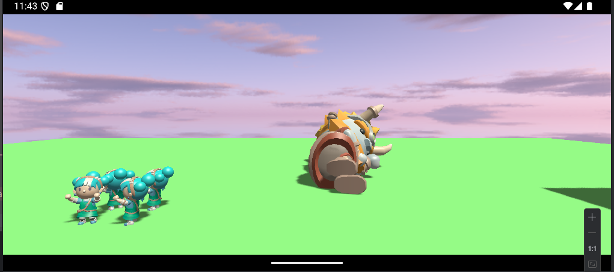

# Golias Engine [](https://github.com/vsaint1/Golias_engine/actions/workflows/build.yml) [](https://github.com/vsaint1/Golias_engine/actions/workflows/docs.yml)  [](https://isocpp.org/std/the-standard) 


**Golias Engine** is a lightweight and modular **2D/3D game engine/framework** written in **C/C++**, designed to be *
*simple yet
powerful**.

> ⚠️ **Note:** Currently there is no `Editor` and one is unlikely to exist in the future.  
> Golias focuses on code-driven development, cross-platform compatibility, and learning.

---

## Key Features

### 3D Features

- [x] **Model Loading** (OBJ, FBX, GLTF/GLB)
- [x] **PBR (Physically Based Rendering)** `SIMPLIFIED`
- [x] **Blinn-Phong Shading Model** 
- [ ] **Skybox Reflections** IBL (Image Based Lighting)
- [ ] Frustrum Culling 
- [x] **Normal mapping** (TBN calculated per fragment)
- [ ] **3D Physics** (Jolt Physics Engine)
- [x] **Lighting System** 
  - [x] **Directional Light**
  - [ ] **Point Light**
  - [ ] **Spotlight** 
- [x] **Shadow Mapping**
  - [ ] **CSM** (Cascaded Shadow Maps) for Directional Lights 
- [ ] **Post-Processing Effects** (Bloom, HDR, SSAO, Motion Blur, etc.)
- [x] **Animation System** (Skeletal Animation)
  - [ ] **GPU** Skinning
- [ ] **Level of Detail (LOD) Support** 
- [x] **Skybox Support** (Cubemap -> 6 faces or Equirectangular)

### 2D Features

- [x] **2D Sprite Rendering**
- [x] **Text/Shaping Rendering** (TrueType fonts and Emojis)
- [x] **Text Shaping** (SDL_TTF + HarfBuzz)
- [ ] **Tilemap Support** (Orthogonal, Isometric)
- [ ] **2D Physics**

### General Features

- [ ] **Audio System** 
- [ ] **Particle System** 
- [x] Cross-Platform **Rendering** and **API** by Design
- [x] **Web (WASM) Support**
- [x] **Native Support:** Windows, Linux, macOS, Android, iOS
- [x] **ECS (Entity Component System) Based**
- [x] **Scripting Support** (Lua)
- [ ] **UI System** (Buttons, Inputs, Checkboxes, etc.)
- [ ] **Using Custom Shaders** (not implemented yet)
- [x] **Forward Rendering**

---

## Supported File Formats

| Asset Type | Supported Formats                              |
|------------|------------------------------------------------|
| 3D Models  | See https://www.assimp.org/ supported formats. |
| Images     | PNG, JPEG, BMP, TGA, DDS, ETC.                 |
| Fonts      | TTF & OTF.                                     |
| Audio      | OGG, WAV, FLAC, MP3, ETC.                      |
| Scenes     | JSON                                           |

## Rendering Backends

> ⚠️ **Note:** Proprietary APIs for consoles are not publicly available and thus cannot be implemented or tested.

| Platform                                                               | Type  | Backend                 | Status            |
|------------------------------------------------------------------------|-------|-------------------------|-------------------|
| Windows, Linux, macOS, Android, iOS, Web.                              | 2D/3D | OpenGL/ES Compatibility | ✅ Fully supported |
| Windows, Linux, macOS, Android, iOS, Web, Nintendo, Playstation, Xbox. | 2D    | SDL_Renderer            | ✅ Fully supported |
| macOS, iOS.                                                            | 3D    | Metal                   | 🚧 Coming soon    |
| Windows, Linux, macOS, Android.                                        | 2D/3D | Vulkan                  | 🚫 No ETA         |
| Windows, Xbox.                                                         | 2D/3D | DirectX 12              | 🚫 No ETA         |
| Nintendo, Playstation, Xbox.                                           | 2D/3D | Proprietary APIs        | 🚫 No ETA         |

## Engine Core Architecture

> ⚠️ **Note:** This diagram is a work in progress and may not reflect the current state of the engine.



---

## 📚 Documentation & Examples

- [Official Documentation](https://vsaint1.github.io/golias-engine)
- [Examples](https://github.com/vsaint1/Golias_engine/tree/main/examples) *(coming soon)*
- [Tests](https://github.com/vsaint1/Golias_engine/tree/main/tests)

---

## 🎮 Games & Demos Created with Golias

| Game                        | Screenshot                             | Description                                            |
|-----------------------------|----------------------------------------|--------------------------------------------------------|
| Flappy Bird                 |           | Simple Flappy Bird clone using Golias Engine (**old**) |
| Node Physics Example        |  | 2D physics simulation (**old**)                        |
| 3D Wireframe                |     | Basic 3D wireframe rendering demo                      |
| Huge City                   |           | Large city scene rendering demo (Web)                  |
| 3D Physics Example          |      | 3D physics simulation with thousands of models         |
| 2D Text Rendering           |            | 2D text rendering with shaping (HarfBuzz)              |
| 3D Animation Demo (Android) |  | 3D model loading and skeletal animation demo           |

---

## 🛠 Building for WebGL

To build the Web version of the engine, you
need [Emscripten](https://emscripten.org/docs/getting_started/downloads.html) installed and activated.

> ⚠️ **Note:** Make sure to source the `emsdk_env.sh` script to set up the environment variables before building.

Then, run the following commands in your terminal:

```bash
git clone https://github.com/vsaint1/golias-engine.git
cd Golias_engine
git submodule update --init --recursive

emcmake cmake --preset=web-debug

emmake cmake --build build/webgl/debug
```

## Third-Party Libraries Used

- [SDL3](https://www.libsdl.org/) - Windowing, Events, Platform Abstraction.
- [GLM](https://glm.g-truc.net/) - Mathematics Library
- [Assimp](https://www.assimp.org/) - 3D Model Importing
- [stb_image]() - Image Loading
- [mini_audio]() - Audio Playback
- [SDL_TTF](https://www.libsdl.org/projects/SDL_ttf/) - TrueType Font Rendering
    - [HarfBuzz](https://harfbuzz.github.io/) - Text Shaping `SUBMODULE`
    - [Plutosvg]() - SVG Loading and Rendering `SUBMODULE`
- [Jolt Physics](https://github.com/jrouwe/JoltPhysics) - 3D Physics Engine
- [sol2](https://www.lua.org/) - Lua Scripting Language Binding
- [flecs](https://flecs.dev/) - Entity Component System (ECS) Framework
- [tinyxml](https://github.com/leethomason/tinyxml2) - XML Parsing
- [nlohmann_json](https://github.com/nlohmann/json) - JSON Parsing
- [glad](https://glad.dav1d.de/) - OpenGL/ES function loader

> All third-party libraries are vendored as git submodules or included directly in the `vendor/` directory.

# License

This project is licensed under the MIT License - see the [LICENSE](LICENSE) file for details.