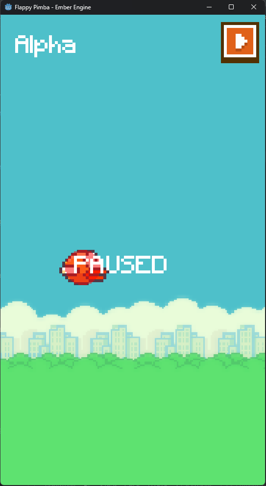
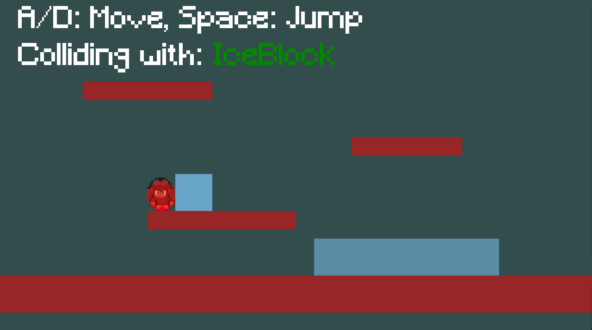

# Ember [](https://github.com/vsaint1/ember_engine/actions/workflows/build.yaml/) [](https://github.com/vsaint1/ember_engine/actions/workflows/docs.yaml) [](https://isocpp.org/std/the-standard) []()

[]()
[]()
[]()
[]()
[]()

**Ember** is a lightweight and modular **2D/3D game engine/framework** written in **C/C++**, designed to be simple yet
powerful. It aims to provide developers with a flexible **_cross-platform_** solution to build 2D/3D games and
applications.

> ⚠️ **Note:** Currently there is no `Editor` and it is unlikely one will exist in the future.

---

## ✨ Features

- 📱 **Cross-Platform**: Windows, Linux, macOS, Android, iOS, Web (via WebGL)
- 🎨 **Graphics Backend**:
    - OpenGL/ES (Windows, Linux, macOS, Android, Web)
    - Metal (macOS, iOS) **(coming soon)**
- 🛠️ **Lightweight Core**: Minimal dependencies for fast builds and portability
- 🎮 **Input, Audio, and Texture Management**: Simple and extensible management systems

---

## 📦 Dependencies

All dependencies are included as git submodules.

- [SDL3](https://github.com/libsdl-org/SDL) – Windowing, Inputs, Events, Audio
- [stb_image](https://github.com/nothings/stb) – Image loader
- [stb_truetype](https://github.com/nothings/stb) – TrueType/SDF font loader
- [stb_vorbis](https://github.com/nothings/stb) – OGG Vorbis audio loader/decoder
- [mini_audio](https://github.com/mackron/miniaudio) – Audio backend
- [glad](https://github.com/Dav1dde/glad) – OpenGL/ES Loader
- [glm](https://github.com/g-truc/glm) – C++ Math Library
- [tinyxml2](https://github.com/leethomason/tinyxml2) – XML Serializer
- [nlohmann/json](https://github.com/nlohmann/json) – JSON Serializer
- [curl](https://curl.se/libcurl/) – Networking / HTTP client
- [OpenSSL](https://www.openssl.org/) / [mbedTLS](https://tls.mbed.org/) – TLS / Crypto
- [Box2D](https://github.com/erincatto/box2d) – 2D physics engine

---

## 📱 Supported Platforms

| Platform | Backend       | Status            |
|----------|---------------|-------------------|
| Windows  | OpenGL 3.3    | ✅ Fully supported |
| Linux    | OpenGL 3.3    | ✅ Fully supported |
| macOS    | OpenGL 3.3    | ✅ Fully supported |
| Android  | OpenGL ES 3.0 | ✅ Fully supported |
| iOS      | OpenGL ES 3.0 | ✅ Fully supported |
| Web      | WebGL 3.0     | ✅ Fully supported |
| iOS      | Metal         | 🚧 Coming soon    |
| macOS    | Metal         | 🚧 Coming soon    |

> ⚠️ **Note:** Metal backend is planned for future versions.

---

## Engine Core Architecture

> ⚠️ **Note:**  This diagram is a work in progress and may not reflect the current state of the engine.


---

## 🎮 Games Created with Ember

Showcase some projects and demos made with Ember Engine:

| Game                 | Screenshot                          | Description                                   |
|----------------------|-------------------------------------|-----------------------------------------------|
| Flappy Bird          |           | Simplest Flappy Bird clone using Ember Engine |
| Node Physics Example |  | Simple node-based physics simulation demo     |
| ...                  | ...                                 | ...                                           |

---

## 📚 Documentation

- [Documentation](https://vsaint1.github.io/ember_engine)
- [Examples](https://github.com/vsaint1/ember_engine/tree/main/examples)  `Soon`
- [Tests](https://github.com/vsaint1/ember_engine/tree/main/tests)

---

## Build System

Ember uses [CMake](https://cmake.org/) as its build system. Supported toolchains:

- Visual Studio (Windows)
- GCC / Clang (Linux / macOS)
- Android NDK (Android)
- Xcode (macOS / iOS)
- Emscripten (WebGL)

---

## Building `WASM`

To build the Web version of the engine, you need to have [Emscripten](https://emscripten.org/docs/getting_started/downloads.html) installed and activated.

> ⚠️ **Note:** Install Emscripten MingW if you're on Windows


```bash
git clone https://github.com/vsaint1/ember_engine.git
cd ember_engine
git submodule update --init --recursive
cmake --list-presets

emcmake cmake --preset=web-release
emmake cmake --build build/webgl/release

python3 -m http.server -b 0.0.0.0 8080
```

Then open your browser and navigate to `http://localhost:8080/build/webgl/`

