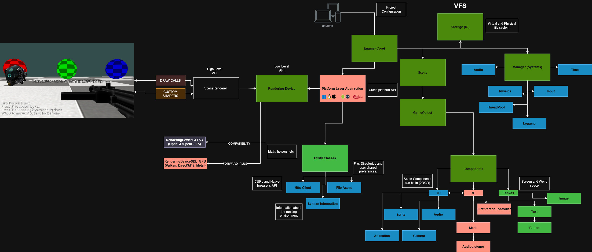

# Golias Engine [](https://github.com/vsaint1/Golias_engine/actions/workflows/build.yml) [](https://github.com/vsaint1/Golias_engine/actions/workflows/docs.yml)  [](https://isocpp.org/std/the-standard) 


**Golias Engine** is a lightweight and modular **2D/3D game engine/framework** written in **C/C++**, designed to be *
*simple yet
powerful**.

> ⚠️ **Note:** Currently there is no `Editor` and one is unlikely to exist in the future.  
> Golias focuses on code-driven development, cross-platform compatibility, and learning.

---

## Rendering Backends & Supported Platforms


| Renderer Backend          | Status            |
|---------------------------|-------------------|
| OpenGL 3.3 / OpenGLES 3.0 | ✅ Fully supported |
| Metal                     | 🚫 No ETA          |
| Vulkan                    | 🚫 No ETA          |
| Direct3D 12               | 🚫 No ETA          |
| Proprietary APIs          | 🚫 No ETA         |

| Platform    | Category | Notes                      | Status |
|-------------|----------|----------------------------|--------|
| Windows     | Desktop  |                            | ✅      |
| Linux       | Desktop  |                            | ✅      |
| macOS       | Desktop  |                            | ✅      |
| Android     | Mobile   |                            | ✅      |
| iOS         | Mobile   |                            | ✅      |
| Web         | Web      | WebAssembly / WebGL        | ✅      |
| Xbox        | Console  | This platform requires NDA | 🚫     |
| PlayStation | Console  | This platform requires NDA | 🚫     |
| Nintendo    | Console  | This platform requires NDA | 🚫     |

> ⚠️ **Note:** Proprietary APIs for consoles are not publicly available and thus cannot be implemented or tested.

## Key Features

### 3D Features

- [x] **Model Loading** 
- [ ] **PBR (Physically Based Rendering)** `SIMPLIFIED`
- [x] **Blinn-Phong Shading Model**
- [ ] **Skybox Reflections** IBL (Image Based Lighting)
- [ ] Frustum Culling
- [ ] **Normal mapping** (TBN calculated per fragment)
- [x] **3D Physics** (Bullet Physics)
- [x] **Lighting System**
    - [x] **Directional Light**
    - [ ] **Point Light**
    - [ ] **Spotlight**
- [ ] **Shadow Mapping**
    - [ ] **CSM** (Cascaded Shadow Maps) for Directional Lights
- [ ] **Post-Processing Effects** (Bloom, HDR, SSAO, Motion Blur, etc.)
- [ ] **Animation System** (Animation)
    - [ ] Skeletal Animation **CPU** & **GPU** Skinning
    - [ ] Hierarchical Animation
- [ ] **Level of Detail (LOD) Support**
- [ ] **Skybox Support** (Cubemap -> 6 faces & Equirectangular)

### 2D Features

- [ ] **2D Sprite Rendering**
- [ ] **Text/Shaping Rendering** (TrueType fonts and Emojis)
- [ ] **Tilemap Support** (Orthogonal, Isometric)
- [ ] **2D Physics** (Box2D)

### General Features

- [ ] **Audio System**
- [ ] **Particle System** (CPU & GPU)
- [x] Cross-Platform **Unified Rendering Pipeline** by Design
- [ ] **Custom Shader Language** based on `GLSL`
- [x] **Web (WASM) Support**
- [x] **Native Support:** Windows, Linux, macOS, Android, iOS and Web
- [x] **GameObject / Entity Component System (ECS)**
- [ ] **Scripting Support** (Lua)
- [ ] **UI System** 
- [ ] **Batched Rendering** 
---

## Supported File Formats

| Asset Type | Supported Formats                              |
|------------|------------------------------------------------|
| 3D Models  | See https://www.assimp.org/ supported formats. |
| Images     | PNG, JPEG, BMP, TGA, DDS, ETC.                 |
| Fonts      | TTF & OTF.                                     |
| Audio      | OGG, WAV, FLAC, MP3, ETC.                      |
| Scenes     | JSON                                           |

## Engine Core Architecture

> ⚠️ **Note:** This diagram is a work in progress and may not reflect the current state of the engine.



---

## 📚 Documentation & Examples

- [Official Documentation](https://vsaint1.github.io/golias-engine)
- [Examples](https://github.com/vsaint1/golias-engine/tree/master/examples)
- [Tests](https://github.com/vsaint1/golias-engine/tree/master/tests)

---


## Build Instructions

````markdown
## Build Instructions

Golias Engine uses CMake Presets to provide a consistent and reproducible build workflow across all supported platforms.

### 1. Common Setup

#### 1.1 Requirements
- CMake 3.25 or newer
- C++20 compatible compiler
- Git

#### 1.2 Repository Setup

```bash
git clone https://github.com/vsaint1/golias-engine.git
cd golias-engine
git submodule update --init --recursive
````

---

### 2. Desktop Platforms

### 2.1 Windows

#### 2.1.1 Requirements

* Windows 10 or newer
* Visual Studio 2022 (MSVC) or LLVM/Clang
* Vulkan SDK (optional)

#### 2.1.2 Build

Debug:

```bash
cmake --preset=windows-debug
cmake --build build/windows/debug
```

Release:

```bash
cmake --preset=windows-release
cmake --build build/windows/release
```

---

### 2.2 Linux

#### 2.2.1 Requirements

* GCC or Clang with C++20 support
* X11 or Wayland development libraries
* Vulkan SDK (optional)

#### 2.2.2 Build

Debug:

```bash
cmake --preset=linux-debug
cmake --build build/linux/debug
```

Release:

```bash
cmake --preset=linux-release
cmake --build build/linux/release
```

---

### 2.3 macOS

#### 2.3.1 Requirements

* macOS 12 or newer
* Xcode Command Line Tools

#### 2.3.2 Build

Debug:

```bash
cmake --preset=macos-debug
cmake --build build/macos/debug
```

Release:

```bash
cmake --preset=macos-release
cmake --build build/macos/release
```

> ⚠️ Note: Metal is automatically selected when building on macOS.

---

### 3. Mobile Platforms

#### 3.1 Android

##### 3.1.1 Requirements

* Android SDK
* Android NDK r25 or newer
* Java 17 or newer

#### 3.1.2 Environment Variables

* ANDROID_HOME
* ANDROID_NDK_HOME

#### 3.1.3 Build

Here is the **correct replacement**, changing **only the Android build section** to reflect **Gradle / Android Studio usage**, while keeping the structure intact.

You can paste this directly over the Android build part.

````markdown
#### 3.1.3 Build

Android builds are generated and managed through **Gradle** and **Android Studio**.

1. Open the Android project in Android Studio:
   - `templates/android/` (or the Android project directory)

2. Ensure the correct NDK and SDK versions are configured.

3. Build from Android Studio **or** via Gradle CLI:

Debug:
```bash
./gradlew assembleDebug
````

See the official Android documentation for generating and managing signin
g keys:  
https://developer.android.com/studio/publish/app-signing#generate-key

Release:

```bash
./gradlew assembleRelease
```

> ⚠️Note: CMake is used internally by Gradle via the configured presets and toolchain files.


---

### 3.2 iOS

#### 3.2.1 Requirements

* macOS with Xcode 14 or newer
* iOS SDK
* Apple Developer account for device deployment

#### 3.2.2 Build

Debug:

```bash
cmake --preset=ios-debug
cmake --build build/ios/debug
```

Release:

```bash
cmake --preset=ios-release
cmake --build build/ios/release
```

Note: Code signing and provisioning must be configured in Xcode.

---

## 4. Web Platform

### 4.1 WebAssembly / WebGL

#### 4.1.1 Requirements

* Emscripten SDK

#### 4.1.2 Environment Setup

```bash
source emsdk_env.sh
```

#### 4.1.3 Build

Debug:

```bash
emcmake cmake --preset=web-debug
emmake cmake --build build/webgl/debug
```

Release:

```bash
emcmake cmake --preset=web-release
emmake cmake --build build/webgl/release
```


## Third-Party Libraries Used

| Library | Description | License |
|--------|-------------|---------|
| **[SDL3](https://github.com/libsdl-org/SDL)** | Windowing, input/events handling, and cross-platform abstraction | Zlib License |
| **[GLM](https://github.com/g-truc/glm)** | Header-only mathematics library for graphics (vectors, matrices, quaternions) | MIT License |
| **[Bullet Physics](https://github.com/bulletphysics/bullet3)** | Real-time 3D physics simulation | Zlib License |
| **[cgltf](https://github.com/jkuhlmann/cgltf)** | Lightweight glTF 2.0 parsing library | MIT License |
| **[tinyobjloader](https://github.com/tinyobjloader/tinyobjloader)** | Wavefront OBJ loader | MIT License |
| **[stb_image](https://github.com/nothings/stb)** | Header-only image loading (PNG, JPG, TGA, etc.) | Public Domain / MIT |
| **[miniaudio](https://github.com/mackron/miniaudio)** | Header-only audio playback and capture library | Public Domain / MIT |
| **[FreeType](https://github.com/freetype/freetype)** | Font rasterization engine | FreeType License (BSD-style) |
| **[nlohmann/json](https://github.com/nlohmann/json)** | Modern C++ JSON serialization/deserialization | MIT License |
| **[glad](https://github.com/Dav1dde/glad)** | OpenGL / OpenGL ES function loader | MIT License |

> All third-party libraries are vendored as git submodules or included directly in the `thirdparty/` directory.

# License

This project is licensed under the MIT License - see the [LICENSE](LICENSE) file for details.